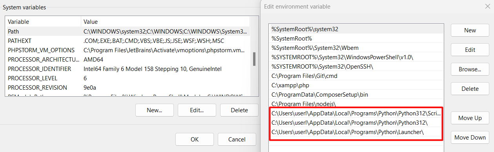

# <p align="center">LaraPY</p>

### Important Note Before Installing "LaraPY"

Before proceeding with the installation of "LaraPY," ensure you have installed and configured the following components:

1. **XAMPP (or Similar Package)**:

    - [Download](https://sourceforge.net/projects/xampp/files/XAMPP%20Windows/8.2.12/xampp-windows-x64-8.2.12-0-VS16-installer.exe) and install XAMPP from [Apache Friends](https://www.apachefriends.org/index.html).
    - Ensure Apache and MySQL are activated after installation.

2. **Composer**:

    - [Download](https://getcomposer.org/Composer-Setup.exe) and install Composer from [getcomposer.org](https://getcomposer.org/download/). [Download Composer]
    - Verify Composer is globally accessible in your terminal.

3. **Node.js and npm**:

    - [Download](https://nodejs.org/dist/v22.3.0/node-v22.3.0-x64.msi) and install Node.js from [nodejs.org](https://nodejs.org/).
    - npm (Node Package Manager) will be installed automatically with Node.js.

4. **Python**:

    - Ensure Python is installed and its path is added to the **System Variable**. [Download](https://www.python.org/ftp/python/3.12.4/python-3.12.4-amd64.exe)

    

These components are essential prerequisites for setting up the development environment for "LaraPY." Please make sure all components are installed and configured correctly before proceeding.

### Installation for Development

If using Git Bash, here are the steps:

1. **Clone the Repository**:

```bash
git clone https://github.com/edosugita/larapy.git
```

2. **Navigate to the Project Directory**:

```bash
cd larapy
```

3. **Install PHP Dependencies**:

```bash
composer install
```

4. **Duplicate the `.env.example` File**:

-   On Unix-based systems (like macOS and Linux):

    ```
    cp .env.example .env
    ```

-   On Windows systems:

    ```
    copy .env.example .env
    ```

5. **Generate a new application key for Laravel:**

```bash
php artisan key:generate
```

6. **Run migrations to create the database schema:**

```bash
php artisan migrate
```

7. **Install JavaScript dependencies using npm:**

```bash
npm install
```

8. **Compile assets using npm:**

```bash
npm run dev
```

9. **Start the Laravel development server:**
Open a new terminal or command prompt window and navigate to your project directory (`larapy`). Then start the Laravel development server:


```bash
php artisan serve
```

10. **Access "LaraPY"**:

 Open your web browser and go to `http://localhost:8000` to view and interact with "LaraPY."

---

Ensure all steps are completed correctly to set up "LaraPY" for local development. Adjust configurations and explore the project structure according to your project's specific requirements.